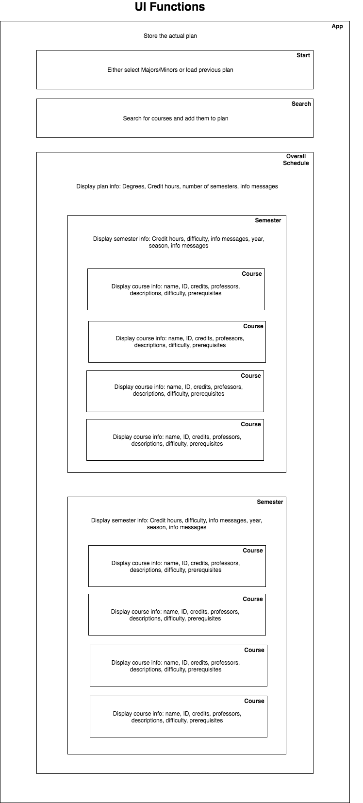
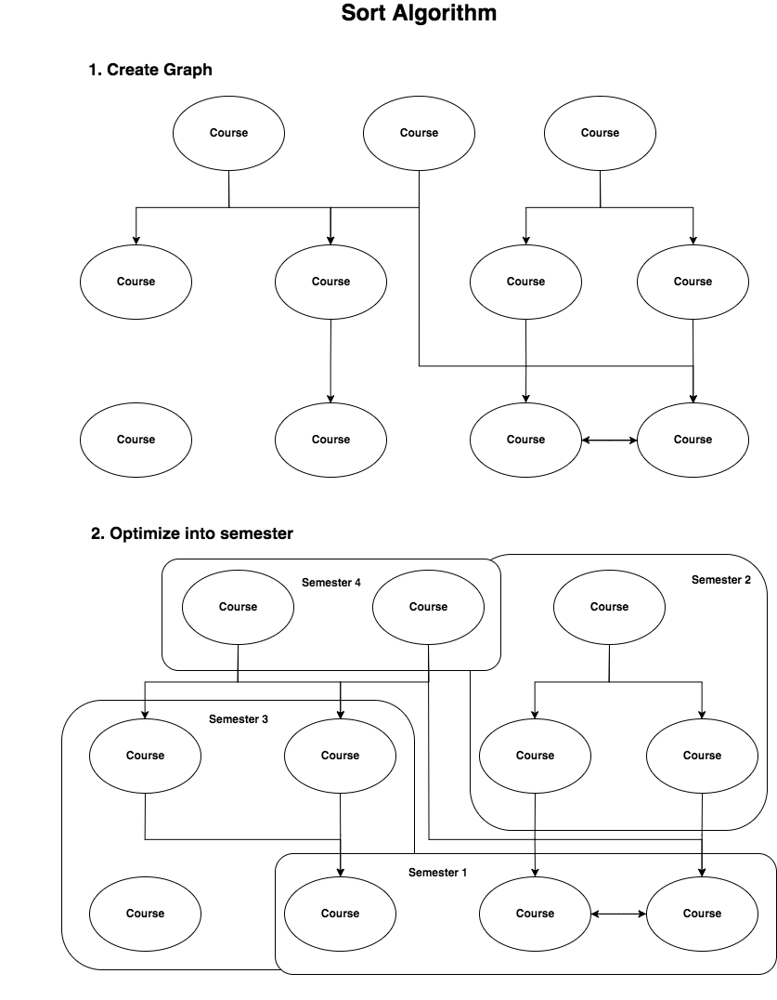

# Course Planner Design 

## About

`course-planner-frontend` is part of an application to help students plan course loads for semesters based of their major/minor, interests, and course difficulty. This repository is the frontend component of the project. For the backend, checkout [course-planner-backend](https://github.com/ufosc/course-scheduler).

## Components

There are two main components in the frontend portion of the application: the UI and Logic. We briefly describe each with technologies that power them.

### UI

The user interface is written with React. It does not modify any of the data directly. Instead, it lets the logic know when an event occurs, and then updates based off of the logic's plan. It is arranged in components (see the diagram below) with the overall schedule showing some information and a list of semesters, each semester shows some information and holds a list of courses, etc.  

Relevant github issues to get started:
- [UI Issues](https://github.com/ufosc/course-planner-frontend/labels/ui)

### Logic

The project uses TypeScript to store and manipulate the course and semester information. It has a set of classes that reflect logical components (courses, semesters, etc). The sorting algorithm works in two faces. First, it creates a graph of courses connected based off their prerequisites. Next it iteratively groups those courses based off: difficulty, credit hours, etc, until it decides on an optimal plan. It retrieves information on degrees and courses from the backend. 

Relevant github issues to get started:
- [Logic Issues](https://github.com/ufosc/course-planner-frontend/labels/logic)

## Resources 

### UI

- [React](https://github.com/ufosc/resources/blob/master/resources/react.md)

### Logic

- [Typescript](https://github.com/ufosc/resources/blob/master/resources/typescript.md)

## Diagrams 

You can load and modify our [diagrams](diagrams.xml) in [draw.io](https://www.draw.io/).

